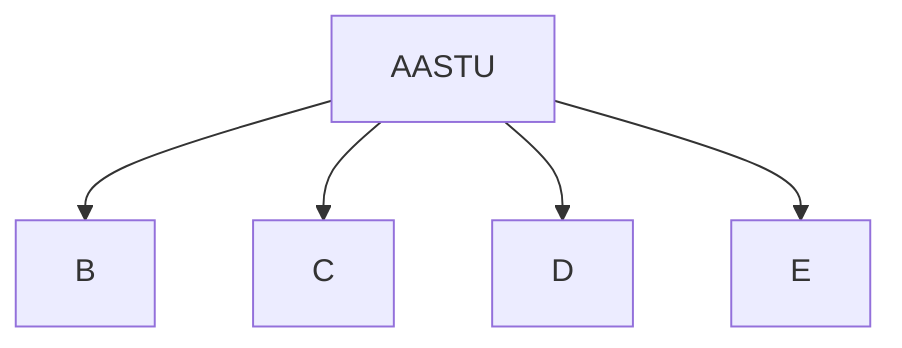

# drawings
This is were i store draw.io drawings   

This is mermaid drawing added in the markdown of the readme for test

```mermaid
  graph TD;
      A[AASTU]-->B;
      A-->C;
      A-->D;
      A-->E;
```
